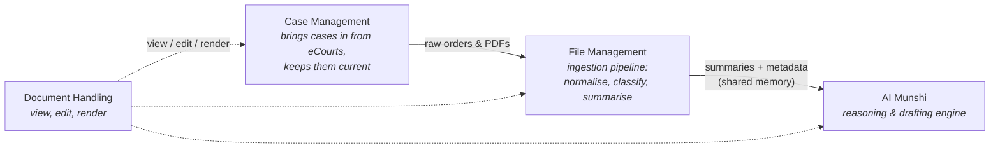

# NowLez

**A legal practice-management platform for Indian advocates, built on the eCourts ecosystem with an AI assistant — _Munshi_ — at its core.**

> **Status — 🧱 Phase 1 scaffold.**
> The [`docs/`](docs/) set is the **source of truth** (the spec, architecture, data model,
> ADRs, and roadmap). On top of it now sits a **TypeScript monorepo**
> ([ADR-0006](docs/decisions/0006-typescript-monorepo-stack.md)): the
> [design contracts](docs/contracts.md), a source-agnostic court-data seam with a mock
> implementation, and stub modules for the four layers — all building, linting, and testing
> green. A first working slice (add-case-by-CNR) comes next — see
> [`docs/roadmap.md`](docs/roadmap.md).

---

## What is NowLez?

NowLez helps a practising advocate manage their entire caseload in one place and
put an AI assistant on top of it. A user **adds a case once**, and from then on the
system tracks it, alerts them to changes, files documents away with summaries, and
lets them ask questions or generate drafts in plain language.

The intended user is an **individual advocate or a small firm** operating across
**District Courts (DC)** and **High Courts (HC)**.

### The two pillars

| Pillar | What it does |
| --- | --- |
| **eCourts integration** | Case details, court orders, and daily cause lists flow into the app automatically from [eCourts](https://ecourts.gov.in/) — India's national judicial data system — rather than being tracked by hand. |
| **The Munshi** | An AI assistant (named after the traditional clerk-scribe who keeps a lawyer's records and prepares drafts) that reads everything the user has and can answer questions, summarise, and draft documents with **traceable citations** back to the source. |

---

## Architecture at a glance

NowLez is organised into **four cooperating layers** plus **three front-ends** that
all sit on the same engine.



**The dependency chain:** Case Management brings in raw documents → File Management
turns them into structured summaries and metadata → those summaries become the
shared memory the Munshi reasons over → and Document Handling is how the user reads
and edits everything throughout.

**Two models, matched to their jobs:**

- A **smaller Gemma 4 model** runs the high-volume File Management pipeline, where
  cost per document matters.
- A **larger Gemma 4 model** powers the Munshi, where reasoning quality matters more
  than per-call cost.

See [`docs/architecture.md`](docs/architecture.md) for the full picture.

---

## The three front-ends

| Surface | Shape | Notes |
| --- | --- | --- |
| **Web app** | Three-pane layout | Nav + case list · working area (viewer / editor / web viewer) · Munshi chat |
| **Mobile app** | Two tabs | **CASES** and **MUNSHI** |
| **WhatsApp** | Lightweight channel | Munshi chat + file upload; case lookups, alerts, cause-list PDF |

See [`docs/interfaces.md`](docs/interfaces.md).

---

## Repository layout

```
.
├── README.md                ← you are here
├── docs/                    ← the source of truth (spec, ADRs, roadmap, contracts)
│   ├── contracts.md             narrative companion to @nowlez/contracts
│   ├── decisions/               Architecture Decision Records (ADRs)
│   └── …                        overview, architecture, data-model, per-layer docs, …
├── packages/                ← the engine (TypeScript)
│   ├── contracts/               @nowlez/contracts — the design contracts
│   ├── court-data/              CourtDataSource implementations + mock + selector
│   ├── case-management/         layer stub
│   ├── file-management/         ingestion-pipeline stub
│   ├── munshi/                  AI-assistant stub
│   └── document-handling/       viewer / editor / docx-pipeline stub
├── apps/                    ← front-end placeholders (Phase 7)
│   ├── web/                     three-pane web app
│   ├── mobile/                  CASES · MUNSHI
│   └── whatsapp/                lightweight Munshi channel
├── package.json             pnpm workspace root + scripts
├── tsconfig*.json · biome.json · vitest.config.ts
├── .github/workflows/ci.yml
└── .gitignore
```

---

## Getting started

Requires **Node ≥ 22** and **pnpm** (`corepack enable` if you don't have it).

```bash
pnpm install        # install workspace dependencies
pnpm run check      # lint (Biome) + typecheck (tsc) + tests (Vitest)

# or run the steps individually:
pnpm run lint
pnpm run typecheck
pnpm run test
```

CI ([`.github/workflows/ci.yml`](.github/workflows/ci.yml)) runs the same `check` on every
push and pull request. The engine lives in [`packages/`](packages/); start at
[`@nowlez/contracts`](packages/contracts) and [`docs/contracts.md`](docs/contracts.md).

---

## Documentation index

Start with [`docs/README.md`](docs/README.md), or jump to:

- **Understand the product:** [Overview](docs/overview.md) → [Architecture](docs/architecture.md) → [Data model](docs/data-model.md)
- **Understand a layer:** [Case Management](docs/case-management.md) · [File Management](docs/file-management.md) · [Munshi](docs/munshi.md) · [Document Handling](docs/document-handling.md)
- **Cross-cutting concerns:** [eCourts integration](docs/ecourts-integration.md) · [Alerts & tracking](docs/alerts-and-tracking.md)
- **Surfaces:** [Interfaces](docs/interfaces.md)
- **The "why" & evidence:** [Decision records](docs/decisions/) · [Open questions](docs/open-questions.md) · [Research](docs/research/)
- **What's next:** [Roadmap](docs/roadmap.md)
- **Unfamiliar term?** [Glossary](docs/glossary.md)

---

## Roadmap snapshot

| Phase | Deliverable | Status |
| --- | --- | --- |
| **0 — Foundation** | Spec & docs as source of truth | ✅ done |
| **1 — Scaffold** | TS monorepo: design contracts, court-data seam + mock, four layer stubs, tooling/CI | ✅ done |
| **2 — MVP slice** | Add-case-by-CNR end to end, through the mock court-data source | 🚧 add-case-by-CNR done |
| **3+ — Build out** | Ingestion pipeline, Munshi tool loop, front-ends | ⏳ |

Full detail in [`docs/roadmap.md`](docs/roadmap.md).

---

## Contributing & conventions

- The `docs/` set is the source of truth. If behaviour and docs disagree, that is a
  bug in one of them — fix both in the same change.
- Significant or hard-to-reverse design choices are recorded as
  [ADRs](docs/decisions/). Add a new one rather than quietly contradicting an old one.
- Domain terminology lives in the [glossary](docs/glossary.md); link to it instead of
  re-explaining terms inline.
- **Keep it green:** `pnpm run check` (lint + typecheck + tests) must pass before pushing;
  CI runs the same.
