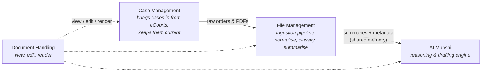

# NowLez

**A legal practice-management platform for Indian advocates, built on the eCourts ecosystem with an AI assistant — _Munshi_ — at its core.**

> **Status — 📐 Specification & documentation foundation.**
> There is no application code in this repository yet. It currently captures the
> product specification, architecture, data model, and roadmap as the shared
> **source of truth** for everyone who builds NowLez. Application scaffolding and
> a first working slice come next — see [`docs/roadmap.md`](docs/roadmap.md).
> The technology stack is **intentionally undecided** at this stage.

---

## What is NowLez?

NowLez helps a practising advocate manage their entire caseload in one place and
put an AI assistant on top of it. A user **adds a case once**, and from then on the
system tracks it, alerts them to changes, files documents away with summaries, and
lets them ask questions or generate drafts in plain language.

The intended user is an **individual advocate or a small firm** operating across
**District Courts (DC)** and **High Courts (HC)**.

### The two pillars

| Pillar | What it does |
| --- | --- |
| **eCourts integration** | Case details, court orders, and daily cause lists flow into the app automatically from [eCourts](https://ecourts.gov.in/) — India's national judicial data system — rather than being tracked by hand. |
| **The Munshi** | An AI assistant (named after the traditional clerk-scribe who keeps a lawyer's records and prepares drafts) that reads everything the user has and can answer questions, summarise, and draft documents with **traceable citations** back to the source. |

---

## Architecture at a glance

NowLez is organised into **four cooperating layers** plus **three front-ends** that
all sit on the same engine.



**The dependency chain:** Case Management brings in raw documents → File Management
turns them into structured summaries and metadata → those summaries become the
shared memory the Munshi reasons over → and Document Handling is how the user reads
and edits everything throughout.

**Two models, matched to their jobs:**

- A **smaller Gemma 4 model** runs the high-volume File Management pipeline, where
  cost per document matters.
- A **larger Gemma 4 model** powers the Munshi, where reasoning quality matters more
  than per-call cost.

See [`docs/architecture.md`](docs/architecture.md) for the full picture.

---

## The three front-ends

| Surface | Shape | Notes |
| --- | --- | --- |
| **Web app** | Three-pane layout | Nav + case list · working area (viewer / editor / web viewer) · Munshi chat |
| **Mobile app** | Two tabs | **CASES** and **MUNSHI** |
| **WhatsApp** | Lightweight channel | Munshi chat + file upload; case lookups, alerts, cause-list PDF |

See [`docs/interfaces.md`](docs/interfaces.md).

---

## Repository layout

```
.
├── README.md            ← you are here
├── docs/                ← the source of truth (this session's deliverable)
│   ├── README.md            index of all documentation
│   ├── overview.md          product framing and scope
│   ├── architecture.md      the four layers, two models, dependency chain
│   ├── data-model.md        Case / Order / File / Mini-Detail / User (+ ER diagram)
│   ├── case-management.md    adding, searching, tracking, cause list
│   ├── ecourts-integration.md  the source-agnostic court-data interface
│   ├── file-management.md    the ingestion pipeline
│   ├── munshi.md            the AI assistant: context, citations, toolset
│   ├── document-handling.md  viewer, editor, web viewer, docx pipeline
│   ├── interfaces.md        web, mobile, WhatsApp
│   ├── alerts-and-tracking.md  daily refresh, alert-worthy vs silent
│   ├── glossary.md          domain terms (CNR, cause list, Munshi, …)
│   ├── roadmap.md           phased plan from docs → scaffold → MVP → build
│   ├── open-questions.md    everything the spec leaves undecided
│   ├── decisions/          Architecture Decision Records (ADRs)
│   └── research/           dated, fact-checked research reports
└── .gitignore
```

---

## Documentation index

Start with [`docs/README.md`](docs/README.md), or jump to:

- **Understand the product:** [Overview](docs/overview.md) → [Architecture](docs/architecture.md) → [Data model](docs/data-model.md)
- **Understand a layer:** [Case Management](docs/case-management.md) · [File Management](docs/file-management.md) · [Munshi](docs/munshi.md) · [Document Handling](docs/document-handling.md)
- **Cross-cutting concerns:** [eCourts integration](docs/ecourts-integration.md) · [Alerts & tracking](docs/alerts-and-tracking.md)
- **Surfaces:** [Interfaces](docs/interfaces.md)
- **The "why" & evidence:** [Decision records](docs/decisions/) · [Open questions](docs/open-questions.md) · [Research](docs/research/)
- **What's next:** [Roadmap](docs/roadmap.md)
- **Unfamiliar term?** [Glossary](docs/glossary.md)

---

## Roadmap snapshot

| Phase | Deliverable | Status |
| --- | --- | --- |
| **0 — Foundation** | Spec & docs as source of truth (this) | ✅ in progress |
| **1 — Scaffold** | Project skeleton; stub modules for the four layers behind the court-data interface | ⏳ next (needs stack decision) |
| **2 — MVP slice** | Add-case-by-CNR end to end, through a stubbed eCourts source | ⏳ |
| **3+ — Build out** | Ingestion pipeline, Munshi tool loop, front-ends | ⏳ |

Full detail in [`docs/roadmap.md`](docs/roadmap.md).

---

## Contributing & conventions

- The `docs/` set is the source of truth. If behaviour and docs disagree, that is a
  bug in one of them — fix both in the same change.
- Significant or hard-to-reverse design choices are recorded as
  [ADRs](docs/decisions/). Add a new one rather than quietly contradicting an old one.
- Domain terminology lives in the [glossary](docs/glossary.md); link to it instead of
  re-explaining terms inline.
