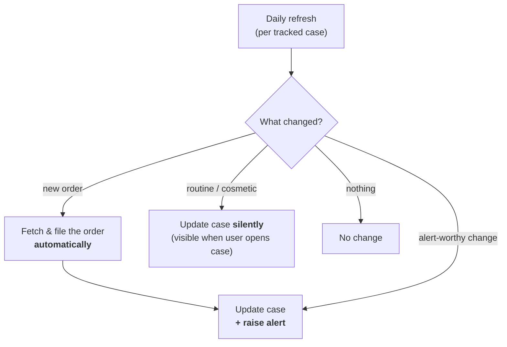
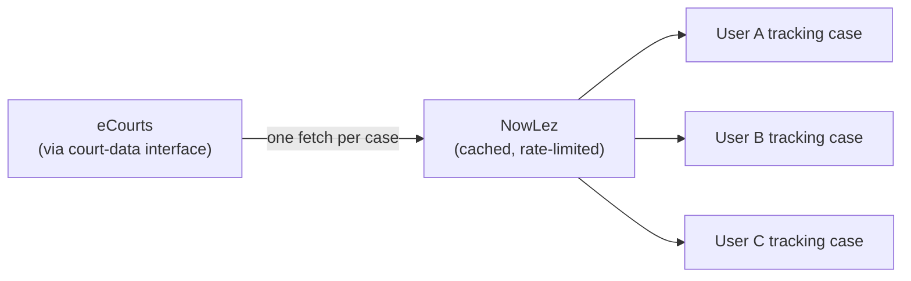

# Alerts & Tracking

Once a case is added it is **tracked**. This document describes the daily refresh cycle,
what makes a change worth alerting on, and the operational discipline that keeps the whole
thing cheap and safe. It is the connective tissue between
[Case Management](case-management.md) and the [eCourts integration](ecourts-integration.md).

## The daily refresh cycle

- Every tracked case is **refreshed on a daily cycle**.
- The refresh **always records whatever has changed.**
- It does **not** notify the user about everything it records.

## What counts as alert-worthy

The refresh sorts every recorded change into one of two buckets:

| Bucket | Behaviour |
| --- | --- |
| **Alert-worthy** | Updates the case **and** raises a **notification** to every user tracking it. |
| **Routine / cosmetic** | Updates the case **silently** in the background. The change is still recorded and remains **visible whenever the user opens the case** — it just doesn't raise a notification. |

### New orders are always alert-worthy

- **New orders are always fetched and filed automatically.**
- A new order is **itself an alert-worthy event**, so it **both** updates the case **and**
  raises an alert.

> The precise catalogue of which field-level changes are "alert-worthy" versus
> "routine/cosmetic" is a product-rules detail the spec does not enumerate beyond "new
> orders". It is tracked in [open questions](open-questions.md#alerts--tracking).

## Fetch once, fan out

To keep both the **load on eCourts** and the **risk of being blocked** low, tracking is
deliberately **not** per-user polling:

- A given case is **fetched once** and the result is **fanned out to every user tracking
  it**.
- Requests are **rate-limited** and **cached**.
- Only **alert-worthy** changes are processed further down the pipeline.

This is the same discipline described in
[`ecourts-integration.md`](ecourts-integration.md#operational-discipline) — recorded here
from the tracking side because it is what makes daily refresh affordable and low-risk.

## Where alerts surface

Alerts reach the user through the [front-ends](interfaces.md):

- **Web** — the **Alerts** entry in the left pane and **alert notifications** in the middle
  working area.
- **Mobile** — the **alerts** icon on the CASES screen.
- **WhatsApp** — **change alerts** and **new order PDFs** delivered to the chat.

## Implementation

The diff / classification engine lives in [`@nowlez/tracking`](../packages/tracking):
`diffCase` compares two case snapshots, and `TrackingService.refresh` re-fetches a tracked
case, persists the latest, and surfaces alert-worthy changes as alerts. It runs against the
mock source today; **fetch-once / fan-out**, **delivery channels**, and **scheduling** of the
daily cycle are deferred (see [open questions](open-questions.md#alerts--tracking)).

## See also

- [`case-management.md`](case-management.md) — tracking from the case-lifecycle side.
- [`ecourts-integration.md`](ecourts-integration.md) — the source the refresh pulls from.
- [`data-model.md`](data-model.md) — the tracking flag on the Case entity.
