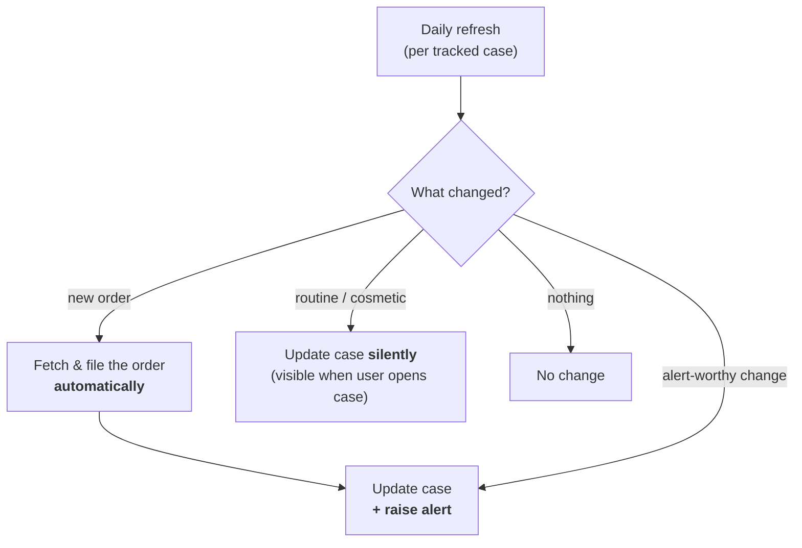
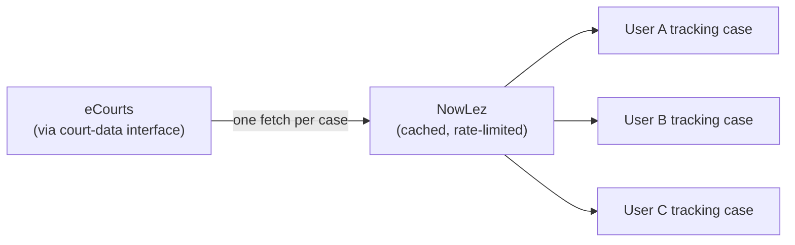

# Alerts & Tracking

Once a case is added it is **tracked**. This document describes the daily refresh cycle,
what makes a change worth alerting on, and the operational discipline that keeps the whole
thing cheap and safe. It is the connective tissue between
[Case Management](case-management.md) and the [eCourts integration](ecourts-integration.md).

## The daily refresh cycle

- Every tracked case is **refreshed on a daily cycle**.
- The refresh **always records whatever has changed.**
- It does **not** notify the user about everything it records.

## What counts as alert-worthy

The refresh sorts every recorded change into one of two buckets:

| Bucket | Behaviour |
| --- | --- |
| **Alert-worthy** | Updates the case **and** raises a **notification** to every user tracking it. |
| **Routine / cosmetic** | Updates the case **silently** in the background. The change is still recorded and remains **visible whenever the user opens the case** — it just doesn't raise a notification. |

### The catalogue (what `diffCase` implements)

| Change | Alert-worthy? |
| --- | --- |
| **New order** (fetched & filed automatically) | ✅ alert |
| **Next hearing date** changed | ✅ alert — the advocate must act on it |
| **Status** changed (incl. a **disposal**) | ✅ alert |
| Case type / parties / filing / registration dates | silent (recorded, visible on open) |

The set of watched fields and their alert/silent flags lives in one place
([`diff.ts`](../packages/tracking/src/diff.ts)) so the catalogue is easy to extend.

### Case lifecycle

A case is **active** until its eCourts status marks it decided/closed (`caseLifecycle`,
[`@nowlez/contracts`](../packages/contracts/src/data-model.ts)). The daily cycle
(`refreshAll`) **skips disposed cases** — no point polling a decided matter — while the disposal
itself is alerted on the refresh that catches it (status → "Disposed"). A single `refresh(cnr)`
still runs on demand.

## Never miss a hearing

The daily refresh says when something *changes*. The flagship promise — **never miss a hearing** —
also needs the standing answer to *"what is coming up, and did anything slip past?"*. That is the
**hearing digest** ([`buildHearingDigest`](../packages/tracking/src/hearings.ts)): a read over the
**stored** caseload (no eCourts call) that places each **tracked, still-active** case on a timeline
relative to *today*.

| Bucket | Meaning |
| --- | --- |
| **Overdue** | The next-hearing date has passed but the matter is still active — check what happened, or whether the date is stale. |
| **Today** / **Tomorrow** | Imminent — act now. |
| **This week** | Within the horizon (default **7 days**). |
| **Later** | Beyond the horizon. |
| **Unscheduled** | No next-hearing date, or one that doesn't parse — surfaced, never silently dropped. |

Dates are parsed tolerantly (ISO `YYYY-MM-DD`, and `DD-MM-YYYY` / `DD/MM/YYYY`). The scope mirrors
`refreshAll` — **tracked + active** — because a disposed matter has no live hearing and an untracked
case isn't kept current. The digest is exposed at **`GET /hearings`** (`?today=` and `?horizon=`
override the reference day and the window) and surfaced in the **web** left pane (a *Hearings*
section), the **CLI** (`nowlez hearings`), and **WhatsApp** (the `hearings` command).

This **complements** the change-driven alerts above rather than replacing them: a moved hearing
date still raises an **alert** on the refresh that catches it, while the digest is the
always-available overview the advocate can glance at any time.

## The daily briefing

The hearing digest and the alert feed answer two halves of the same question; the **daily briefing**
([`buildDailyBriefing`](../packages/tracking/src/briefing.ts)) joins them into one morning summary —
the **imminent hearings** (overdue / today / tomorrow) plus the **unread alerts**. A quiet day is
reported as such ("all clear"). It is exposed at **`GET /briefing`** and surfaced as the **CLI**
`briefing` command, the **WhatsApp** `briefing` command, and a compact *Today* banner at the top of
the web left pane.

## Notifications

Alerts and the briefing are always **recorded** in the in-app feed; a **notification** is the *push*
to an outside channel. Delivery is routed through a `Notifier` (`apps/server`) governed by
single-tenant **preferences**:

| Preference | Env | Default |
| --- | --- | --- |
| Push alert-worthy changes | `NOWLEZ_PUSH_ALERTS` | on |
| Which alert kinds push | `NOWLEZ_ALERT_KINDS` (allow-list) | all |
| Push the daily briefing | `NOWLEZ_DAILY_BRIEFING` | off |

Today the only push channel is the single WhatsApp `WHATSAPP_ALERT_RECIPIENT`, while the in-app feed
(web / mobile) always has everything. **Per-user** preferences and **multi-recipient routing** await
the [auth / tenancy model](open-questions.md#data-model) — the preferences object is the
single-tenant seam they will extend.

## Fetch once, fan out

To keep both the **load on eCourts** and the **risk of being blocked** low, tracking is
deliberately **not** per-user polling:

- A given case is **fetched once** and the result is **fanned out to every user tracking
  it**.
- Requests are **rate-limited** and **cached**.
- Only **alert-worthy** changes are processed further down the pipeline.

This is the same discipline described in
[`ecourts-integration.md`](ecourts-integration.md#operational-discipline) — recorded here
from the tracking side because it is what makes daily refresh affordable and low-risk.

## Where alerts surface

Alerts reach the user through the [front-ends](interfaces.md):

- **Web** — the **Alerts** entry in the left pane and **alert notifications** in the middle
  working area.
- **Mobile** — the **alerts** icon on the CASES screen.
- **WhatsApp** — **change alerts** and **new order PDFs** delivered to the chat.

## Implementation

The diff / classification engine lives in [`@nowlez/tracking`](../packages/tracking):
`diffCase` compares two case snapshots and applies the **catalogue** above (new orders +
next-hearing/status changes alert; other fields silent), and `TrackingService.refresh` re-fetches a
tracked case, persists the latest, and surfaces alert-worthy changes as alerts; `refreshAll` skips
**disposed** cases. Those alerts are
**persisted** through an [`AlertStore`](decisions/0015-alert-store-and-delivery.md) port
([`@nowlez/persistence`](../packages/persistence): in-memory + file adapters; idempotent by
alert id), exposed as a **feed** (`GET /alerts`, `POST /alerts/:id/read`) the web app renders,
and **pushed** best-effort to a configured WhatsApp number (`WHATSAPP_ALERT_RECIPIENT`). The whole
cycle (`runRefreshCycle`) runs on demand (`POST /refresh`) or on a timer via an opt-in
**scheduler** (`NOWLEZ_REFRESH_INTERVAL_MS`; external cron can call it too). Alongside the
change-driven engine, `buildHearingDigest` ([`hearings.ts`](../packages/tracking/src/hearings.ts))
computes the [upcoming-hearings digest](#never-miss-a-hearing) and `buildDailyBriefing`
([`briefing.ts`](../packages/tracking/src/briefing.ts)) composes the
[daily briefing](#the-daily-briefing) (`GET /hearings`, `GET /briefing`); a `Notifier`
([`notifier.ts`](../apps/server/src/notifier.ts)) pushes alerts and the briefing per the
[preferences](#notifications) above. It runs against the mock source today; **fetch-once /
fan-out**, **multi-recipient routing**, and time-of-day/staggering policy are deferred (see
[open questions](open-questions.md#alerts--tracking)).

## See also

- [`case-management.md`](case-management.md) — tracking from the case-lifecycle side.
- [`ecourts-integration.md`](ecourts-integration.md) — the source the refresh pulls from.
- [`data-model.md`](data-model.md) — the tracking flag on the Case entity.
