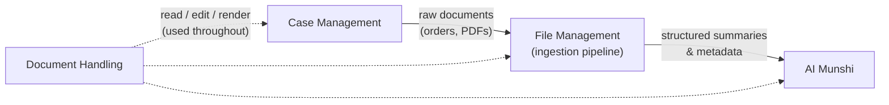
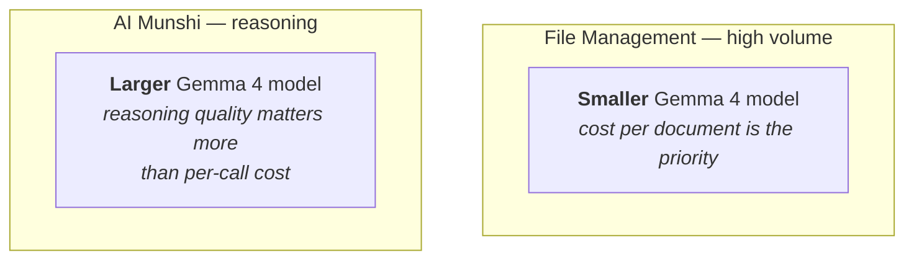
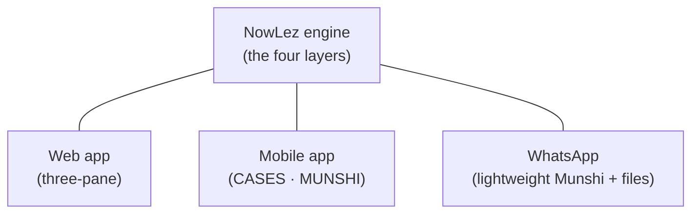

# System Architecture

The product is organised into **four cooperating layers**, plus **three front-ends** that
all sit on the same engine.

## The four layers

| Layer | Responsibility | Runs on |
| --- | --- | --- |
| **[Case Management](case-management.md)** | Get cases into the system from eCourts and keep them current. | eCourts integration (no model) |
| **[File Management](file-management.md)** (ingestion pipeline) | Take every document — pulled from eCourts or uploaded — and normalise, classify, and summarise it. | **Smaller** Gemma 4 model |
| **[AI Munshi](munshi.md)** | The reasoning and drafting engine; reads the summaries the other layers produce, answers questions, and writes drafts. | **Larger** Gemma 4 model |
| **[Document Handling](document-handling.md)** | How documents are viewed, edited, and rendered across the app. | OnlyOffice + docx pipeline |

## The dependency chain

A useful way to see how the layers relate:

- **Case Management** brings in raw documents.
- **File Management** turns them into structured summaries and metadata.
- Those summaries become the **shared memory** that the **AI Munshi** reasons over.
- **Document Handling** is how the user actually reads and edits everything throughout — it
  is cross-cutting rather than a stage in the pipeline.

The output of File Management — _a tidy set of summarised documents, each linked to a
case_ — is **the layer that everything else depends on**.

## Two models, deliberately matched to their jobs

NowLez uses two distinct AI models, each chosen for the job it does. See
[ADR-0003](decisions/0003-two-model-split.md) for the reasoning.

| Model | Used by | Why |
| --- | --- | --- |
| **Smaller Gemma 4** | File Management pipeline | Processes a high volume of documents; **cost per document** is the priority. |
| **Larger Gemma 4** | AI Munshi | **Reasoning quality** matters more than per-call cost. |

## Source-agnostic court data

A defining architectural decision: **all of NowLez talks to a single source-agnostic
court-data interface**, and the eCourts mobile-app scraper is merely *one implementation*
behind it. The Munshi, the ingestion pipeline, and the alert engine **never know where
case data comes from**.

This containment lets NowLez swap the data source — to a web-portal scrape or a commercial
API — by changing a single selector and nothing else. It is important enough to have its
own document and ADR:

- [`ecourts-integration.md`](ecourts-integration.md)
- [ADR-0002](decisions/0002-source-agnostic-court-data-interface.md)
- [ADR-0004](decisions/0004-extract-from-ecourts-mobile-app.md)

## The three front-ends

The same underlying engine is exposed through three surfaces, each suited to a different
mode of use. They are described in [`interfaces.md`](interfaces.md).

## See also

- [`data-model.md`](data-model.md) — the entities these layers operate on.
- [`decisions/`](decisions/) — the load-bearing architectural choices, recorded.
