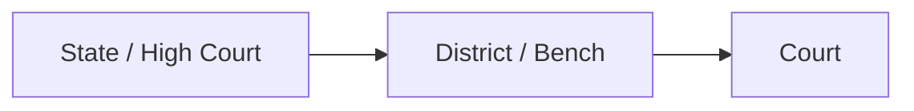
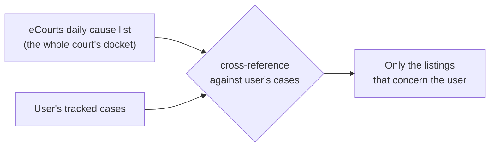

# Case Management

This layer is **how a case enters NowLez and stays up to date**. It targets both
**District Courts** and **High Courts**, and it is the front of the
[dependency chain](architecture.md#the-dependency-chain): the raw documents it brings in
feed the [ingestion pipeline](file-management.md).

All court data it works with comes through the **source-agnostic court-data interface** —
see [`ecourts-integration.md`](ecourts-integration.md).

## Adding a case

A user can bring a case in two ways:

| Method | What happens |
| --- | --- |
| **CNR number** | The user enters the [CNR](glossary.md#cnr) — the unique Case Number Record that identifies any case in eCourts. |
| **QR code scan** | Scanning the QR code pulls the **full case details** and retrieves the case's **order PDFs**. |

## Searching for a case

When the user doesn't have a CNR in hand, they can **search**. There are two search paths:

1. **By party name** — narrowing by **party** and **year**.
2. **By case number** — built from the **case type**, the **case number**, and the **year**.

Both searches are scoped through a **hierarchy of court selectors**:

1. **State or High Court**, then
2. **District or Bench**, then
3. the specific **Court**.

## Tracking

Once a case is in the system, it is **tracked**:

- It is **refreshed on a daily cycle**.
- The refresh **always records whatever has changed** — but it does **not notify the user
  about everything it records**.
- Only **[alert-worthy](alerts-and-tracking.md#what-counts-as-alert-worthy)** changes raise
  a notification. Routine or cosmetic changes update the case **silently** in the
  background, where they remain visible whenever the user opens the case.
- **New orders are always fetched and filed automatically.** Because a new order is itself
  an alert-worthy event, it **both** updates the case **and** raises an alert.

The full mechanics — including how a case is fetched once and fanned out to every user
tracking it — are in [`alerts-and-tracking.md`](alerts-and-tracking.md).

## Daily cause list

The system also works with the court's published **[daily cause list](glossary.md#cause-list)**
— the schedule of cases to be heard that day.

NowLez **cross-references that list** (sourced from eCourts) **against the user's own
cases**, so the advocate sees **only the listings that concern them** rather than the
entire court's docket.

## Data access

Every feature above is powered by the **source-agnostic court-data interface**. Because
eCourts exposes no official API, the primary implementation behind that interface
**extracts data from the eCourts Services mobile app backend**. This is significant enough
to have its own document:

- [`ecourts-integration.md`](ecourts-integration.md) — how data is obtained, and the
  fallback strategy.
- [ADR-0002](decisions/0002-source-agnostic-court-data-interface.md) — the interface.
- [ADR-0004](decisions/0004-extract-from-ecourts-mobile-app.md) — the mobile-app choice.

## See also

- [`data-model.md`](data-model.md) — the Case, Order, and File entities.
- [`alerts-and-tracking.md`](alerts-and-tracking.md) — the daily refresh and alert rules.
