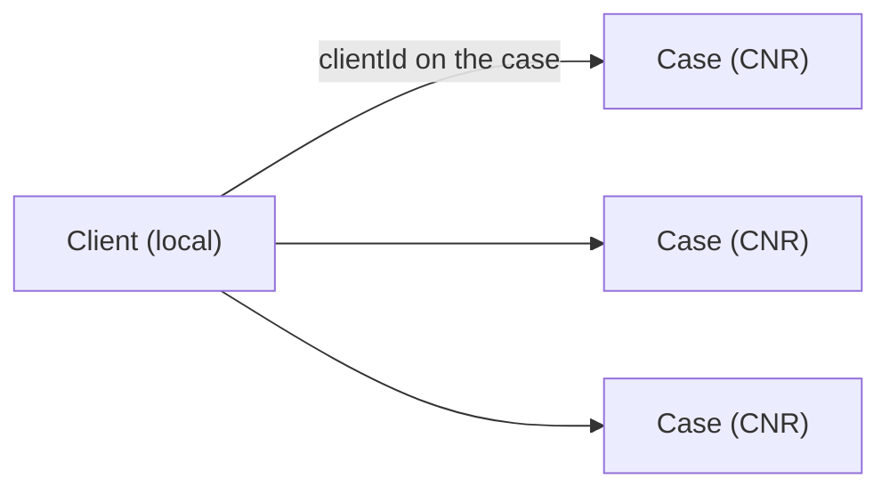

# Clients

An advocate's cases belong to **clients**. A **Client** is a NowLez-local entity — the person (or
organisation) the advocate represents — and is deliberately *not* part of eCourts. It lets the
product answer "show me everything for this client" and "send this client an update", without
disturbing the [CNR-as-sole-key](decisions/0001-cnr-as-sole-primary-key.md) rule for cases.

## The model

| Attribute | Description |
| --- | --- |
| **id** | A generated `ClientId` (NowLez-local; not an eCourts identifier). |
| **name** | The client's name (required). |
| **phone** | Contact number — also where [client updates](#client-updates) are delivered (WhatsApp). |
| **email** / **notes** | Optional contact email and free-text notes. |

A case is **linked** to a client through the case's optional **`clientId`** — a *local attribute*,
exactly like the [tracking flag](data-model.md#case). One client holds **many** cases; a case has
**at most one** client. Assignment never changes a case's identity (it stays keyed by its CNR), so
this is purely additive — see [ADR-0017](decisions/0017-clients-local-entity.md).

## Managing clients

Client management lives in [`ClientService`](../packages/case-management/src/clients.ts)
([`@nowlez/case-management`](../packages/case-management)) over a
[`ClientRepository`](../packages/contracts/src/client.ts) port (in-memory + file adapters in
[`@nowlez/persistence`](../packages/persistence)):

- **Create / list** clients.
- **Assign** a case to a client (or clear the assignment).
- **List a client's cases** (every case whose `clientId` matches).

## Client updates

A **client update** ([`buildClientUpdate`](../packages/tracking/src/client-update.ts)) is a
client-facing summary of one client's matters — the **near-term hearings** across their cases
(overdue → this week) plus the **recent alert-worthy changes** — composed from the same
[hearing digest](alerts-and-tracking.md#never-miss-a-hearing) and [alert feed](alerts-and-tracking.md)
the advocate already relies on, but phrased for the client. The advocate reviews it and sends it; a
quiet matter reads as such.

## Where clients surface

- **HTTP API** — `GET/POST /clients`, `GET /clients/:id`, `GET /clients/:id/cases`,
  `POST /cases/:cnr/client` (assign/clear), `GET /clients/:id/update` (compose), and
  `POST /clients/:id/notify` (send the update over WhatsApp).
- **Web** — a **Clients** section in the left pane (list + add), and an **assign-to-client** control
  plus **Send update** on the case working area.
- **CLI** — `clients`, `add-client`, `assign`, and `client-update`.

## See also

- [`data-model.md`](data-model.md) — the Client entity and the `clientId` link on a Case.
- [ADR-0017](decisions/0017-clients-local-entity.md) — Client as a NowLez-local entity.
- [`alerts-and-tracking.md`](alerts-and-tracking.md) — the hearings/alerts a client update is built from.
