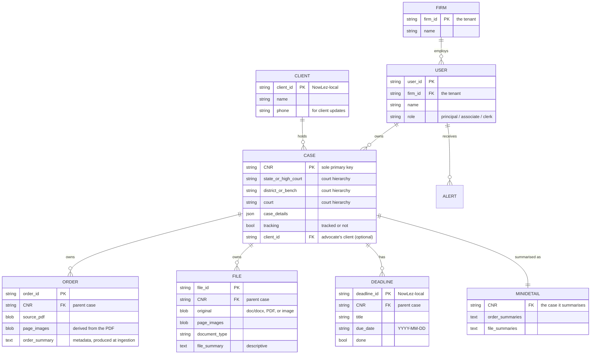

# Data Model

The **[Case](glossary.md#case)** is the central entity. Everything else hangs off it.

## Entity-relationship overview

> The diagram reflects the conceptual model in the specification. Concrete column types,
> nullability, indexing, and where binary content actually lives (database vs. object
> storage) are **[open questions](open-questions.md#data-model)** to settle when a stack and
> storage strategy are chosen.

## Case

The Case is the central entity, and its **CNR is the sole primary key**. There is **no
separate internal identifier** — every case in the system is keyed by, and referenced
through, its CNR. See [ADR-0001](decisions/0001-cnr-as-sole-primary-key.md).

A Case carries:

| Attribute | Description |
| --- | --- |
| **CNR** | The [Case Number Record](glossary.md#cnr); sole primary key. |
| **Court hierarchy** | The path that located the case: **State / High Court → District / Bench → Court**. |
| **Case details** | The case's details as obtained from eCourts. |
| **Tracking flag** | Whether the case is being [tracked](alerts-and-tracking.md) for daily refresh. |
| **Client** | The advocate's [client](clients.md) for this matter, if assigned — an optional local `clientId` link, **not** part of the case's identity ([ADR-0017](decisions/0017-clients-local-entity.md)). |

A case's **lifecycle** (`active` / `disposed`) is *derived* from its eCourts status rather than
stored — the daily refresh stops polling once a matter is [disposed](alerts-and-tracking.md#case-lifecycle).

Each Case **owns a collection of [Orders](#order)** and **a collection of [Files](#file)**,
both of which reference their parent case by its CNR.

### Consequence of CNR-as-sole-key

Because a case cannot exist without a CNR, the product can represent **only cases that
eCourts has already registered**. A matter tracked before it has a CNR, or any forum
outside the eCourts/CNR system, falls **outside the data model by design** — a boundary
consistent with the product's District Court and High Court scope. This is called out in
the [overview](overview.md#scope-and-boundaries) and recorded as
[ADR-0001](decisions/0001-cnr-as-sole-primary-key.md).

## Order

An **Order** belongs to a Case and is identified by an **Order ID**. It stores:

- the **source PDF**,
- the **page images** derived from it,
- an **order summary** (the metadata) produced at [ingestion](file-management.md).

Orders are **fetched from eCourts** and can **arrive automatically** when a tracked case
updates (see [alerts & tracking](alerts-and-tracking.md)).

## File

A **File** also belongs to a Case and is identified by a **File ID**. It stores:

- the **original** (`doc`/`docx`, PDF, or image),
- its **page images**,
- a **document type**,
- a **descriptive file summary**.

Files are **user-uploaded** or **AI-drafted** (produced by the Munshi's
[write-docx tool](munshi.md#the-toolset)).

## Case Mini-Detail / Summary

A **Case Mini-Detail / Summary** record is the **compact representation of a case** — its
**order summaries and file summaries** — that gets loaded into the
[Munshi's context](munshi.md#context-assembly). This is what lets the assistant reason
across the whole caseload **without holding every full document**. Each entry also carries its
**id** and **page count**, so the Munshi can [cite](munshi.md#citation-discipline) a specific,
existing page.

## Client

A **Client** is the advocate's client — a NowLez-local entity ([clients.md](clients.md),
[ADR-0017](decisions/0017-clients-local-entity.md)), **not** an eCourts record. It carries an
`id`, a `name`, and optional `phone` / `email` / `notes`. A case is linked to a client through the
case's optional **`clientId`** (one client → many cases; a case → at most one client), so grouping
by client never changes a case's CNR-keyed identity. Clients are stored behind a
**`ClientRepository`** port; [client updates](clients.md#client-updates) are composed from the
hearing digest + alert feed and delivered to the client's phone.

## Deadline

A **Deadline** is a dated obligation on a case — a limitation or filing due date
([deadlines.md](deadlines.md), [ADR-0018](decisions/0018-deadlines-and-limitation.md)). Like a
Client it is **NowLez-local**: its own `id`, a `title`, a `dueDate` (`YYYY-MM-DD`), an optional
`rule` (the limitation rule it was computed from), and a `done` flag. It references its case by CNR
but never changes the case record. Due dates may be entered directly or **computed** by the
limitation calculator. Deadlines are stored behind a **`DeadlineStore`** port and surfaced via the
[deadline digest](deadlines.md#the-deadline-digest), mirroring hearings.

## Firm & User

The **Firm** is the **tenant** ([auth.md](auth.md), [ADR-0019](decisions/0019-auth-and-identity.md)) —
a solo advocate is a firm of one. A **User** belongs to one firm with a **role** (`principal` /
`associate` / `clerk`), owns cases, receives [alerts](alerts-and-tracking.md), and interacts through
any of the [three front-ends](interfaces.md). A user carries optional login identifiers (`email`,
`phone`) and credentials (`passwordHash`, `googleSub`) so the same account can sign in by phone OTP,
email + password, or Google. Per-tenant **scoping** of cases/clients/deadlines/alerts by firm is the
next step (6b); today the identity model + auth engine exist and case data is not yet firm-scoped.

## Order vs. File at a glance

| | **Order** | **File** |
| --- | --- | --- |
| **Identified by** | Order ID | File ID |
| **Belongs to** | a Case (by CNR) | a Case (by CNR) |
| **Origin** | Fetched from eCourts | User-uploaded or AI-drafted |
| **Original format** | PDF | `doc`/`docx`, PDF, or image |
| **Stores** | source PDF, page images, order summary | original, page images, document type, file summary |
| **Summary field** | order summary (descriptive) | descriptive file summary |

## See also

- [`file-management.md`](file-management.md) — how page images and summaries are produced.
- [`munshi.md`](munshi.md) — how mini-details are loaded as context.
- [ADR-0001](decisions/0001-cnr-as-sole-primary-key.md) — CNR as the sole primary key.
