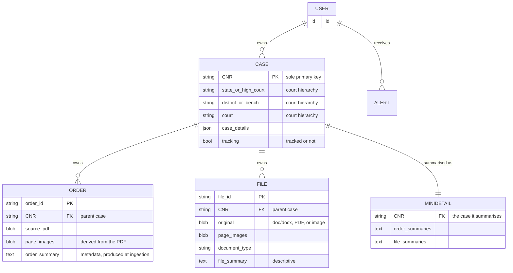

# Data Model

The **[Case](glossary.md#case)** is the central entity. Everything else hangs off it.

## Entity-relationship overview

> The diagram reflects the conceptual model in the specification. Concrete column types,
> nullability, indexing, and where binary content actually lives (database vs. object
> storage) are **[open questions](open-questions.md#data-model)** to settle when a stack and
> storage strategy are chosen.

## Case

The Case is the central entity, and its **CNR is the sole primary key**. There is **no
separate internal identifier** — every case in the system is keyed by, and referenced
through, its CNR. See [ADR-0001](decisions/0001-cnr-as-sole-primary-key.md).

A Case carries:

| Attribute | Description |
| --- | --- |
| **CNR** | The [Case Number Record](glossary.md#cnr); sole primary key. |
| **Court hierarchy** | The path that located the case: **State / High Court → District / Bench → Court**. |
| **Case details** | The case's details as obtained from eCourts. |
| **Tracking flag** | Whether the case is being [tracked](alerts-and-tracking.md) for daily refresh. |

Each Case **owns a collection of [Orders](#order)** and **a collection of [Files](#file)**,
both of which reference their parent case by its CNR.

### Consequence of CNR-as-sole-key

Because a case cannot exist without a CNR, the product can represent **only cases that
eCourts has already registered**. A matter tracked before it has a CNR, or any forum
outside the eCourts/CNR system, falls **outside the data model by design** — a boundary
consistent with the product's District Court and High Court scope. This is called out in
the [overview](overview.md#scope-and-boundaries) and recorded as
[ADR-0001](decisions/0001-cnr-as-sole-primary-key.md).

## Order

An **Order** belongs to a Case and is identified by an **Order ID**. It stores:

- the **source PDF**,
- the **page images** derived from it,
- an **order summary** (the metadata) produced at [ingestion](file-management.md).

Orders are **fetched from eCourts** and can **arrive automatically** when a tracked case
updates (see [alerts & tracking](alerts-and-tracking.md)).

## File

A **File** also belongs to a Case and is identified by a **File ID**. It stores:

- the **original** (`doc`/`docx`, PDF, or image),
- its **page images**,
- a **document type**,
- a **descriptive file summary**.

Files are **user-uploaded** or **AI-drafted** (produced by the Munshi's
[write-docx tool](munshi.md#the-toolset)).

## Case Mini-Detail / Summary

A **Case Mini-Detail / Summary** record is the **compact representation of a case** — its
**order summaries and file summaries** — that gets loaded into the
[Munshi's context](munshi.md#context-assembly). This is what lets the assistant reason
across the whole caseload **without holding every full document**. Each entry also carries its
**id** and **page count**, so the Munshi can [cite](munshi.md#citation-discipline) a specific,
existing page.

## User

A **User** owns cases, receives [alerts](alerts-and-tracking.md), and interacts through any
of the [three front-ends](interfaces.md).

## Order vs. File at a glance

| | **Order** | **File** |
| --- | --- | --- |
| **Identified by** | Order ID | File ID |
| **Belongs to** | a Case (by CNR) | a Case (by CNR) |
| **Origin** | Fetched from eCourts | User-uploaded or AI-drafted |
| **Original format** | PDF | `doc`/`docx`, PDF, or image |
| **Stores** | source PDF, page images, order summary | original, page images, document type, file summary |
| **Summary field** | order summary (descriptive) | descriptive file summary |

## See also

- [`file-management.md`](file-management.md) — how page images and summaries are produced.
- [`munshi.md`](munshi.md) — how mini-details are loaded as context.
- [ADR-0001](decisions/0001-cnr-as-sole-primary-key.md) — CNR as the sole primary key.
