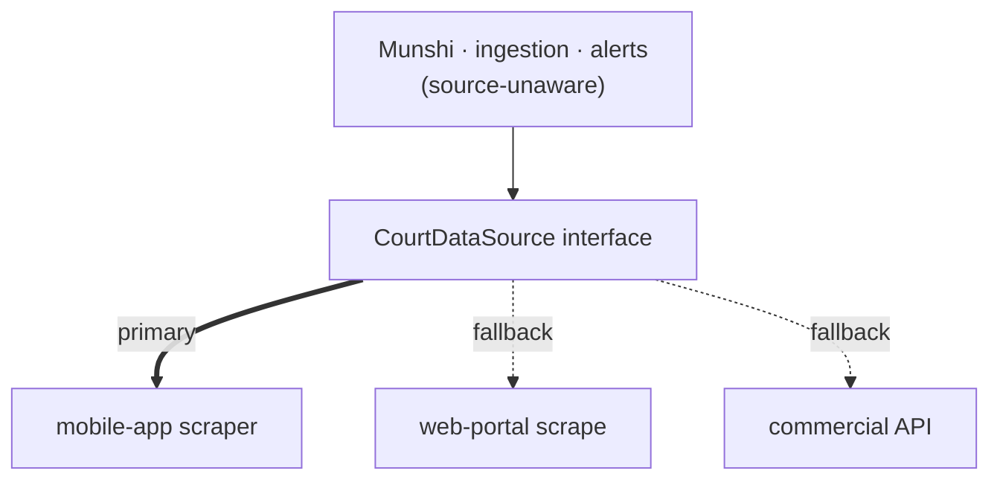

# ADR-0002 — A single source-agnostic court-data interface

**Status:** Accepted (agreed in specification)

## Context

All court data — case details, order PDFs, cause lists — enters NowLez from eCourts, which
exposes **no official API**. The chosen primary acquisition method
([ADR-0004](0004-extract-from-ecourts-mobile-app.md)) relies on an **undocumented** backend
that can be **changed or locked down without notice**, or might come to require
**device-integrity attestation** an automated client cannot satisfy.

The rest of the system — the [Munshi](../munshi.md), the
[ingestion pipeline](../file-management.md), the [alert engine](../alerts-and-tracking.md) —
needs court data but should not be coupled to *how* it is obtained.

## Decision

**All of NowLez talks to a single source-agnostic court-data interface
(`CourtDataSource`).** Concrete data sources are **implementations behind that interface**:

- the **eCourts mobile-app scraper** — the **primary** implementation;
- the **eCourts web-portal scrape** — a fallback;
- a **commercial data API** — a fallback.

The rest of the system **never knows where case data comes from**. Switching sources is
**changing a single source selector and nothing else**.

## Consequences

- **Containment of an unstable dependency.** The blast radius of an undocumented API
  changing is confined to one implementation behind the seam.
- **Cheap failover.** If the mobile backend breaks or starts requiring attestation, flip the
  selector to the web-portal or commercial implementation — no changes ripple outward.
- **Testability.** A stub/mock `CourtDataSource` lets the
  [MVP slice](../roadmap.md#phase-2--mvp-slice-add-case-by-cnr-end-to-end) and tests run with
  **no real eCourts calls**.
- **Discipline lives at the seam.** Rate-limiting, caching, and
  [fetch-once / fan-out](../alerts-and-tracking.md#fetch-once-fan-out) are natural
  responsibilities of this layer.

## Alternatives considered

- **Letting each consumer call eCourts directly.** Rejected: couples the whole system to an
  unstable, undocumented source and makes failover a rewrite.

## Open items

- Exact interface signatures and where caching/rate-limiting sit — see
  [open questions](../open-questions.md#ecourts-integration).

## Related

- [`../ecourts-integration.md`](../ecourts-integration.md)
- [ADR-0004](0004-extract-from-ecourts-mobile-app.md)
