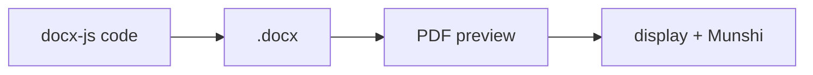

# ADR-0005 — OnlyOffice editor + docx-js → PDF-preview pipeline

**Status:** Accepted (agreed in specification)

## Context

NowLez needs to **view, edit, create, and generate** documents across the app, and the
[Munshi](../munshi.md) needs to **draft** Word documents programmatically. Two related needs:

1. A way for users to **edit and create** documents inside the app.
2. A way for the assistant to **generate** documents and show a faithful preview.

## Decision

- **Editing & creation** are handled by **[OnlyOffice](../glossary.md#onlyoffice)**, an
  embedded office suite. The **Create New document** action opens a **blank document directly
  in this editor**.
- **Generation** uses a **[docx-js](../glossary.md#docx-js)** pipeline: the Munshi writes
  **docx-js code → it compiles to a `.docx` → the `.docx` is rendered to a PDF preview** for
  display and for feeding back to the Munshi.

## Consequences

- **One rendering path.** The docx-to-preview rendering is the **same** as the Word →
  PDF-preview step in the [ingestion pipeline](../file-management.md#step-1--normalisation-everything-becomes-page-images),
  so generated drafts and uploaded Word files share a single, consistent rendering path.
- **In-app editing.** Users never leave NowLez to edit or create documents.
- **Programmatic drafting.** Representing drafts as docx-js **code** lets the LLM generate
  structured documents rather than free-form text.
- **Operational surface.** OnlyOffice must be deployed/hosted, and the docx-js code the LLM
  emits must be **executed safely** (sandboxing) — both tracked in
  [open questions](../open-questions.md#document-handling).

## Related

- [`../document-handling.md`](../document-handling.md)
- [`../munshi.md#the-write-docx-flow`](../munshi.md#the-write-docx-flow)
- [`../file-management.md`](../file-management.md)
