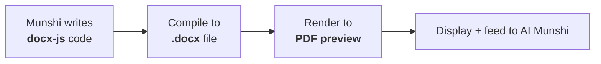

# Document Handling

This layer covers **how documents are read, edited, and rendered everywhere** in the
product. It is cross-cutting — used throughout the
[dependency chain](architecture.md#the-dependency-chain) rather than being a stage in it.

## Document viewer

The viewer must handle **three kinds of content** and serve **both Orders and Files**:

| Content type | Serves |
| --- | --- |
| **PDF** | Orders and Files |
| **doc / docx** | Orders and Files |
| **images** | Orders and Files |

## Document editor

Editing is handled through **[OnlyOffice](glossary.md#onlyoffice)**, an **embedded office
suite**, so the user can edit documents **inside the app**.

It is also where **new documents are created**: the **Create New document** action opens a
**blank document directly in this editor**. See [ADR-0005](decisions/0005-onlyoffice-and-docx-js.md).

## Web viewer

A **URL-based web viewer** lets the user open **external web content** within the app — for
example, a source the [Munshi cited by URL](munshi.md#citation-discipline).

## The docx generation pipeline

When the Munshi [drafts a document](munshi.md#the-write-docx-flow), the flow is:

1. The model writes **[docx-js](glossary.md#docx-js) code**.
2. That code **compiles into a `.docx` file**.
3. The `.docx` is **rendered to a PDF preview** for display and for the AI Munshi.

This **mirrors the same docx-to-preview rendering** used in the
[ingestion pipeline](file-management.md#step-1--normalisation-everything-becomes-page-images),
where Word files are rendered to a PDF preview before being turned into page images. Keeping
a single rendering path is recorded as part of
[ADR-0005](decisions/0005-onlyoffice-and-docx-js.md).

## How the pieces fit on screen

On the [web app](interfaces.md#web-application), all three live in the **middle (working
area) pane**:

- **document viewer** (PDF, doc/docx, images — orders and files),
- **document editor** (OnlyOffice),
- **web viewer** (URL).

> The choice of PDF renderer, the OnlyOffice deployment model (self-hosted vs. hosted), and
> the docx-js execution sandbox are
> **[open questions](open-questions.md#document-handling)** for implementation time.

## Implementation

[`@nowlez/document-handling`](../packages/document-handling) implements the **docx generation
pipeline**: `DocxPipeline.compile` runs the Munshi's docx-js code through a sandbox
(`NodeVmDocxSandbox`, [ADR-0012](decisions/0012-docx-sandbox.md)) to produce a real `.docx`, and
`renderPdfPreview` renders it via the [`DocumentRenderer`](decisions/0008-document-renderer-port.md).
`MammothDocxReader` (the **read-docx** side) extracts the text back out of a `.docx`. The compiled
bytes are persisted through a [`BlobStore`](decisions/0014-blob-store-port.md)
([`@nowlez/storage`](../packages/storage)) and referenced by an AI-drafted
[File](data-model.md#file), so the Munshi can read its own draft back. The [web app](interfaces.md#web-application)
renders **PDFs and images inline** in the working-area pane (the server serves them with
`Content-Disposition: inline` via `GET /files/:id?disposition=inline`); **doc/docx** in-browser
rendering, the OnlyOffice editor, and the URL web viewer are still to come.

> ⚠️ The sandbox uses `node:vm` — scope-restricted with a timeout, but **not** a security
> boundary against malicious code. Untrusted input needs a real isolate; see ADR-0012.

## See also

- [`munshi.md`](munshi.md) — the write-docx tool that feeds this pipeline.
- [`file-management.md`](file-management.md) — the shared docx-to-preview rendering.
- [`interfaces.md`](interfaces.md) — where viewer, editor, and web viewer appear.
