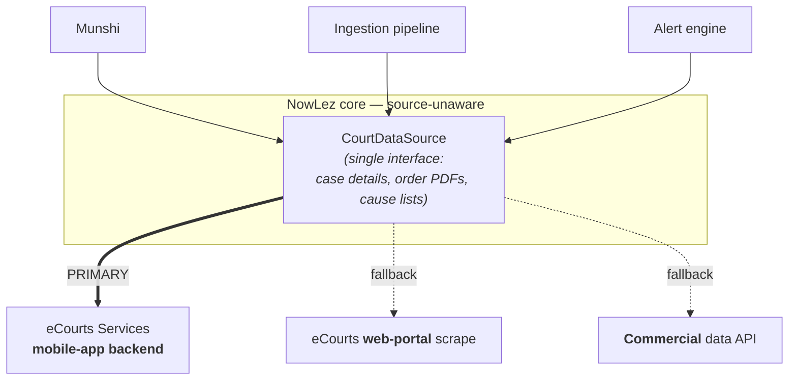
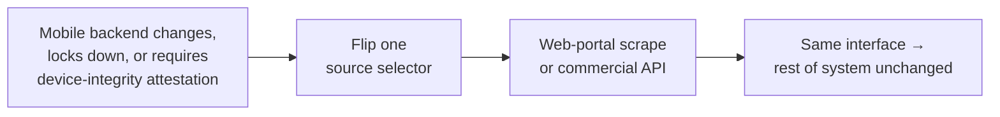

# eCourts Integration & the Court-Data Interface

This document covers **how NowLez obtains court data**, and — more importantly — the
architecture that keeps the rest of the system insulated from *where* that data comes from.

> **⚠️ Updated 2026-06-07 (APK teardown — codec extracted).** Two static teardowns now back this:
> the [2026-06-05 report](research/2026-06-05-ecourts-apk-teardown.md) (a React-Native/Hermes build)
> established the **CAPTCHA-free, attestation-free** posture; the
> [2026-06-07 report](research/2026-06-07-ecourts-apk-teardown.md) (a Cordova/WebView build) recovered
> the **full request/response codec** from plain JS. That codec is now implemented in
> [`ecourts-codec.ts`](../packages/court-data/src/ecourts-codec.ts) and **proven byte-identical** to
> the app's own CryptoJS by a known-answer test — no live call, no MITM. The real protocol
> (`GET …/ecourt_mobile_DC/<svc>.php?params=<AES blob>`, encrypted Bearer token, encrypted response
> bodies) is wired into `EcourtsMobileSource`. The **mobile-app backend remains the primary source**;
> the gates before live traffic are now just **legal/compliance sign-off** and an optional
> response-shape confirmation — see [ADR-0016](decisions/0016-ecourts-mobile-source.md) and the
> [go-live runbook](runbooks/ecourts-mitm-and-codec.md).

## The most important decision is architectural, not technical

> **All of NowLez talks to a single source-agnostic court-data interface, and the
> mobile-app scraper is merely one implementation sitting behind it.**

The rest of the system — the [Munshi](munshi.md), the [ingestion pipeline](file-management.md),
the [alert engine](alerts-and-tracking.md) — **never knows where case data comes from**.

This containment is **deliberate**, because an undocumented API can be changed or locked
down without notice. Recorded as
[ADR-0002](decisions/0002-source-agnostic-court-data-interface.md).

## Why the mobile app backend is the primary source

eCourts exposes **no self-serve public API** (official APIs such as NAPIX and NJDG exist but are
gated to government/authorized partners). NowLez obtains **case data, order PDFs, and cause lists**
by extracting them from the backend of the **official eCourts Services _mobile app_**.

This was chosen over two alternatives:

| Option | Why not (primary) |
| --- | --- |
| Scraping the public eCourts **web portal** | Deliberately guarded by **CAPTCHAs** that resist automation. |
| Buying access from a **commercial third-party** data provider | A dependency and cost; kept as a fallback rather than the primary. |
| **eCourts Services mobile app backend** ✅ | Its API is **not CAPTCHA-guarded**, unlike the web portal. |

Because that backend is **undocumented**, the integration is built by
**reverse-engineering the app — decompiling it**. Recorded as
[ADR-0004](decisions/0004-extract-from-ecourts-mobile-app.md).

## The fallback strategy

An undocumented API can be changed or locked down without notice, or the mobile backend
might turn out to require **device-integrity attestation** that an automated client cannot
satisfy. Should either happen, NowLez **falls back to an alternative implementation of the
same interface** — the **web-portal scrape** or a **commercial API** — by changing a
**single source selector and nothing else**.

## Operational discipline

The integration is disciplined to keep both the **load on eCourts** and the **risk of being
blocked** low. This dovetails with the [tracking and alert design](alerts-and-tracking.md):

- Requests are **rate-limited** and **cached**.
- A given case is **fetched once and fanned out to every user tracking it**, rather than
  polled per user.
- Only the **[alert-worthy changes](alerts-and-tracking.md#what-counts-as-alert-worthy)**
  are processed further.

## What this interface provides

The interface is the single seam through which all court data enters NowLez. Conceptually
it serves the [Case Management](case-management.md) features:

- **Case details** by CNR (and via QR).
- **Order PDFs** for a case.
- **Search** — by party name, and by case number — scoped through the
  State/HC → District/Bench → Court hierarchy.
- **Daily cause lists** for cross-referencing against the user's cases.

> The exact method signatures, request/response shapes, auth handling, and where caching
> and rate-limiting live are **[open questions](open-questions.md#ecourts-integration)** to
> be settled when the interface is implemented.

## Implementation

[`@nowlez/court-data`](../packages/court-data) ships the **`MockCourtDataSource`** (dev/tests)
and **`EcourtsMobileSource`** ([ADR-0016](decisions/0016-ecourts-mobile-source.md)) — the
mobile-app path of [ADR-0004](decisions/0004-extract-from-ecourts-mobile-app.md). It maps
**all six operations** (case-by-CNR/QR, orders, the two searches, cause-list) over an **injectable
HTTP transport** and the **verified codec** ([`ecourts-codec.ts`](../packages/court-data/src/ecourts-codec.ts),
extracted in the [2026-06-07 teardown](research/2026-06-07-ecourts-apk-teardown.md) and KAT-proven
against the app's CryptoJS): each call is `GET …/ecourt_mobile_DC/<svc>.php?params=<AES blob>` with an
encrypted Bearer token and an AES-encrypted response body. The verified request paths/params (CNR via
`cinum`, party via `pet_name`) are wired; the inner **response field names** stay behind lenient
mappers, **PROVISIONAL** until an authorized capture confirms them. **Operational discipline** lives
at the seam too: `RateLimitedCourtDataSource` + `CachingCourtDataSource` (the fetch-once/fan-out
window), wired into `selectCourtDataSourceFromEnv` via `NOWLEZ_COURT_MIN_INTERVAL_MS` /
`NOWLEZ_COURT_CACHE_TTL_MS`. Select the source with `NOWLEZ_COURT_SOURCE=ecourts-mobile`; `GET /config`
reports it. Going live still needs **legal/compliance sign-off** (and an optional response-shape
confirmation) — see the **[go-live runbook](runbooks/ecourts-mitm-and-codec.md)**. The web-portal and
commercial sources remain selectable stubs.

## See also

- [`case-management.md`](case-management.md) — the features this interface powers.
- [`alerts-and-tracking.md`](alerts-and-tracking.md) — fetch-once / fan-out and caching.
- [ADR-0002](decisions/0002-source-agnostic-court-data-interface.md),
  [ADR-0004](decisions/0004-extract-from-ecourts-mobile-app.md).
