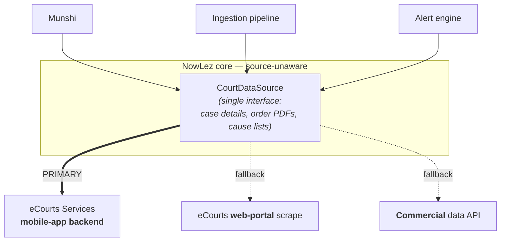
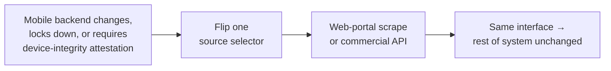

# eCourts Integration & the Court-Data Interface

This document covers **how NowLez obtains court data**, and — more importantly — the
architecture that keeps the rest of the system insulated from *where* that data comes from.

> **⚠️ Research update (2026-06-05).** A
> [fact-checked study](research/2026-06-05-ecourts-gemma-landscape.md) found the **mobile-app premise
> below unsubstantiated by public evidence**: no public teardown of the eCourts app's API exists, and
> the *proven* path used by every open-source tool and commercial reseller is the **web-portal scrape
> + CAPTCHA-OCR**. Read the "primary source" framing below as the spec's original intent; the current
> working assumption is **web-portal-scrape as the proven default, mobile-app backend as a hypothesis
> to validate**. See [ADR-0004](decisions/0004-extract-from-ecourts-mobile-app.md) (Research update)
> and [open questions](open-questions.md#ecourts-integration).

## The most important decision is architectural, not technical

> **All of NowLez talks to a single source-agnostic court-data interface, and the
> mobile-app scraper is merely one implementation sitting behind it.**

The rest of the system — the [Munshi](munshi.md), the [ingestion pipeline](file-management.md),
the [alert engine](alerts-and-tracking.md) — **never knows where case data comes from**.

This containment is **deliberate**, because an undocumented API can be changed or locked
down without notice. Recorded as
[ADR-0002](decisions/0002-source-agnostic-court-data-interface.md).

## Why the mobile app backend is the primary source

eCourts exposes **no self-serve public API** (official APIs such as NAPIX and NJDG exist but are
gated to government/authorized partners). NowLez obtains **case data, order PDFs, and cause lists**
by extracting them from the backend of the **official eCourts Services _mobile app_**.

This was chosen over two alternatives:

| Option | Why not (primary) |
| --- | --- |
| Scraping the public eCourts **web portal** | Deliberately guarded by **CAPTCHAs** that resist automation. |
| Buying access from a **commercial third-party** data provider | A dependency and cost; kept as a fallback rather than the primary. |
| **eCourts Services mobile app backend** ✅ | Its API is **not CAPTCHA-guarded**, unlike the web portal. |

Because that backend is **undocumented**, the integration is built by
**reverse-engineering the app — decompiling it**. Recorded as
[ADR-0004](decisions/0004-extract-from-ecourts-mobile-app.md).

## The fallback strategy

An undocumented API can be changed or locked down without notice, or the mobile backend
might turn out to require **device-integrity attestation** that an automated client cannot
satisfy. Should either happen, NowLez **falls back to an alternative implementation of the
same interface** — the **web-portal scrape** or a **commercial API** — by changing a
**single source selector and nothing else**.

## Operational discipline

The integration is disciplined to keep both the **load on eCourts** and the **risk of being
blocked** low. This dovetails with the [tracking and alert design](alerts-and-tracking.md):

- Requests are **rate-limited** and **cached**.
- A given case is **fetched once and fanned out to every user tracking it**, rather than
  polled per user.
- Only the **[alert-worthy changes](alerts-and-tracking.md#what-counts-as-alert-worthy)**
  are processed further.

## What this interface provides

The interface is the single seam through which all court data enters NowLez. Conceptually
it serves the [Case Management](case-management.md) features:

- **Case details** by CNR (and via QR).
- **Order PDFs** for a case.
- **Search** — by party name, and by case number — scoped through the
  State/HC → District/Bench → Court hierarchy.
- **Daily cause lists** for cross-referencing against the user's cases.

> The exact method signatures, request/response shapes, auth handling, and where caching
> and rate-limiting live are **[open questions](open-questions.md#ecourts-integration)** to
> be settled when the interface is implemented.

## See also

- [`case-management.md`](case-management.md) — the features this interface powers.
- [`alerts-and-tracking.md`](alerts-and-tracking.md) — fetch-once / fan-out and caching.
- [ADR-0002](decisions/0002-source-agnostic-court-data-interface.md),
  [ADR-0004](decisions/0004-extract-from-ecourts-mobile-app.md).
