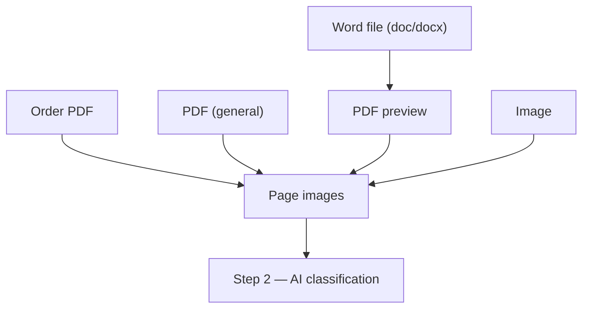
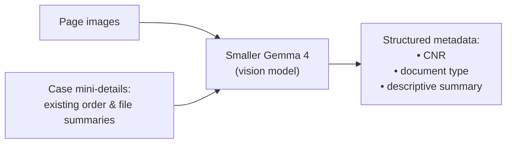

# File Management (Ingestion Pipeline)

This layer **takes any incoming artifact and turns it into something structured and
searchable**. It runs on the **smaller [Gemma 4](glossary.md#gemma-4) model**, because it
processes a high volume of documents and **cost per document is the priority** (see
[ADR-0003](decisions/0003-two-model-split.md)).

Its output — _a tidy set of summarised documents, each linked to a case_ — is **the layer
that everything else depends on** (see [architecture](architecture.md#the-dependency-chain)).

## What it handles

Two broad categories of files flow through it:

| Category | Source | Formats |
| --- | --- | --- |
| **Orders** | Pulled from eCourts | PDF |
| **User-uploaded files** | Uploaded by the user | `doc`/`docx`, PDF, images |

## Step 1 — Normalisation (everything becomes page images)

Whatever the format, the pipeline first converts the document into **page images**, because
a **vision model** is what reads them. The paths differ slightly by format:

| Input | Normalisation path |
| --- | --- |
| **Order PDF** | Rendered to page images **directly**. |
| **PDF** (general) | Rendered to page images **directly**. |
| **Word file** (`doc`/`docx`) | First rendered to a **PDF preview**, which is then turned into page images. |
| **Image** | Already in the right form — **passes straight through**. |

> The Word → PDF preview → page images path mirrors the docx-to-preview rendering used in
> the [document handling](document-handling.md#the-docx-generation-pipeline) pipeline.

## Step 2 — AI classification & summarisation

The page images are fed to the **smaller Gemma model**, which returns **structured
metadata** for the document:

- the **[CNR](glossary.md#cnr)** the document belongs to,
- the **document type**, and
- a **descriptive file summary** — _for orders, only the descriptive order summary_.

## Shared context

The model performing this classification is given the **case mini-details** as context —
specifically the existing **order summaries** and **file summaries** — so that it can:

- place each new document accurately **within the right case**, and
- relate it to **what's already there**.

## The output

The result is written back to the data model:

- For an **Order** — its **order summary** (the metadata) is stored on the
  [Order](data-model.md#order).
- For a **File** — its **document type** and **descriptive file summary** are stored on the
  [File](data-model.md#file).

Either way, each document ends up **linked to a case** and represented in that case's
[Mini-Detail / Summary](data-model.md#case-mini-detail--summary), which is what the
[Munshi](munshi.md) later reasons over.

> The page-image resolution, the exact prompt/response schema for the Gemma call, document
> de-duplication, and failure/retry handling are
> **[open questions](open-questions.md#file-management)** for implementation time.

## Implementation

[`@nowlez/file-management`](../packages/file-management) implements **normalisation**
(`normalize` routes each format to page images via the
[`DocumentRenderer`](../packages/rendering) port) and **classification** (`classify` calls the
smaller Gemma model through the [`ModelClient`](decisions/0009-model-client-port.md) port and
validates the result). Both use deterministic fakes today; the real rasteriser and a model
endpoint switch on without code changes. Real input arrives via **file upload**
(`POST /cases/:cnr/files` stores a `user-uploaded` File in the [`BlobStore`](decisions/0014-blob-store-port.md)),
and **`ingest`** (uploaded Files) / **`ingestOrder`** (court Order PDFs) run the **end-to-end
runner** (normalise → classify → write `summary` + page images, and `documentType` for files,
back onto the artifact) — wired at `POST /files/:id/ingest` and `POST /cases/:cnr/ingest`, triggered
automatically after upload / add-case. The real renderer (`PdfjsDocumentRenderer`,
[ADR-0008](decisions/0008-document-renderer-port.md)) is built; wiring its injected pdfjs-dist +
canvas (and page-image resolution) is the runtime piece.

## See also

- [`data-model.md`](data-model.md) — Orders, Files, and Mini-Details.
- [`munshi.md`](munshi.md) — how the summaries this layer produces become context.
- [`document-handling.md`](document-handling.md) — the shared docx-to-preview rendering.
