# Interfaces

The same underlying engine is exposed through **three surfaces**, each suited to a different
mode of use.

| Surface | Shape |
| --- | --- |
| [Web application](#web-application) | Three-pane layout |
| [Mobile application](#mobile-application) | Two tabs: **CASES** and **MUNSHI** |
| [WhatsApp](#whatsapp) | Lightweight Munshi channel + file upload |

---

## Web application

A **three-pane layout**.

```mermaid
flowchart LR
    subgraph L["LEFT — navigation &amp; case list"]
        direction TB
        H["App header<br/>(NowLez wordmark + user control)"]
        AL["Alerts"]
        CLst["Cause list"]
        CN["+ Create New document<br/>(opens blank doc in OnlyOffice)"]
        AC["+ Case · + Files"]
        Cases["Case A ▸ orders &amp; files<br/>Case B ▸ Order 1, Order 2,<br/>File 1, File 2 …"]
        Usr["User (bottom)"]
    end
    subgraph Mid["MIDDLE — working area"]
        direction TB
        Cal["Cause-list calendar"]
        Notif["Alert notifications"]
        CD["Case details"]
        V["Document viewer<br/>(PDF, doc/docx, images;<br/>orders &amp; files)"]
        Ed["Document editor (OnlyOffice)"]
        WV["Web viewer (URL)"]
    end
    subgraph R["RIGHT — AI Munshi chat"]
        direction TB
        UM["User's message"]
        TC["Tool calls (as they happen)"]
        Resp["Response (inline citations)"]
        Draft["Draft document"]
        Comp["Composer: + Files · voice"]
    end
    L --- Mid --- R
```

### Left pane — navigation & case list

- The **app header** (NowLez wordmark and a user control).
- A **Today** banner at the very top — the [daily briefing](alerts-and-tracking.md#the-daily-briefing)
  distilled to a line (overdue / today hearings + new alerts), shown only when there's something to act on.
- Top-level entries for **Alerts**, **Hearings** (the upcoming-hearings digest), and **Cause list**.
- A **Create New document** action near the top that opens a blank document in the
  [OnlyOffice editor](document-handling.md#document-editor).
- The **+ Case** and **+ Files** actions for adding cases and uploading documents.
- Below that, the **list of cases** (Case A, Case B, …), each **expandable** to show its
  orders and files (Order 1, Order 2, File 1, File 2).
- The logged-in **user** sits at the bottom.

### Middle pane — working area

Surfaces the **cause-list calendar**, **alert notifications**, and **case details**, and
contains:

- the **[document viewer](document-handling.md#document-viewer)** (PDF, doc/docx, images,
  for both orders and files),
- the **[document editor](document-handling.md#document-editor)** (OnlyOffice), and
- the **[web viewer](document-handling.md#web-viewer)** (URL).

### Right pane — AI Munshi chat

Shows the **user's message**, the assistant's **tool calls** as they happen, the
**response** (with [inline citations](munshi.md#citation-discipline)), and any **draft
document** produced. The **composer** at the bottom supports attaching files (**+ Files**)
and **voice** input.

---

## Mobile application

The mobile app presents the same capabilities in a phone layout, organised under **two
tabs**: **CASES** and **MUNSHI**.

### CASES screen

- The **header** (user control and add action).
- The **alerts / cause-list** icons.
- A **Create New document** action near the top.
- The **+ Case** and **+ Files** actions.
- The **scrollable case list** with **expandable** orders and files.

### MUNSHI screen

The assistant chat:

- **user message**,
- the **[ask-user-question](munshi.md#the-toolset)** prompts and **tool calls**,
- the **response with inline citations**, and
- a **draft document** (e.g., an order/draft `.doc`).

The **composer** supports **+ Files** attachment and **voice** input.

---

## WhatsApp

A **lightweight AI Munshi** WhatsApp channel, along with file upload (**+Files**), exposes
the most common actions **without opening the full app**. Through WhatsApp the user can:

- **look up case details** and pull **order PDFs** by **CNR** or **QR**,
- see **upcoming hearings** (the `hearings` command — [never miss a hearing](alerts-and-tracking.md#never-miss-a-hearing)),
- get the **daily briefing** (the `briefing` command),
- receive **change alerts** and **new order PDFs**, and
- get the **daily cause-list PDF**.

---

## Capability coverage across surfaces

| Capability | Web | Mobile | WhatsApp |
| --- | :---: | :---: | :---: |
| Munshi chat (cited responses) | ✅ | ✅ | ✅ (lightweight) |
| Add case by CNR / QR | ✅ | ✅ | ✅ (lookup + order PDFs) |
| Upload files (+ Files) | ✅ | ✅ | ✅ |
| Voice input | ✅ | ✅ | — |
| Document viewer / editor (OnlyOffice) | ✅ | ✅ | — |
| Web viewer (URL) | ✅ | ✅ | — |
| Create New document | ✅ | ✅ | — |
| Alerts | ✅ | ✅ | ✅ |
| Hearings (upcoming digest) | ✅ | — | ✅ (`hearings`) |
| Daily briefing | ✅ (Today banner) | — | ✅ (`briefing`) |
| Cause list | ✅ (calendar) | ✅ | ✅ (PDF) |

> This coverage table is a reading of the specification's per-surface descriptions; exact
> mobile/WhatsApp feature parity is an
> **[open question](open-questions.md#interfaces)** where the spec is not explicit.

## See also

- [`munshi.md`](munshi.md) — the chat that powers the right pane / MUNSHI tab / WhatsApp.
- [`document-handling.md`](document-handling.md) — viewer, editor, and web viewer.
- [`alerts-and-tracking.md`](alerts-and-tracking.md) — where alerts come from.
