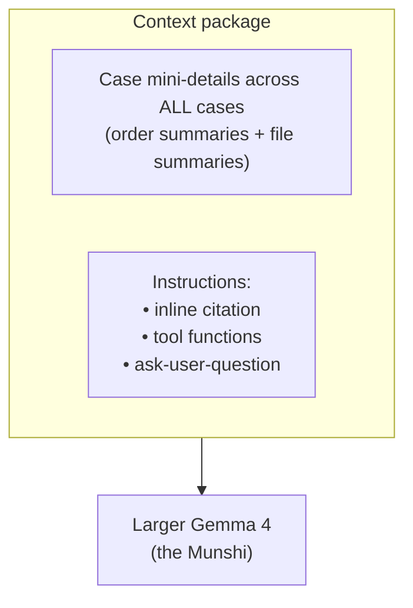
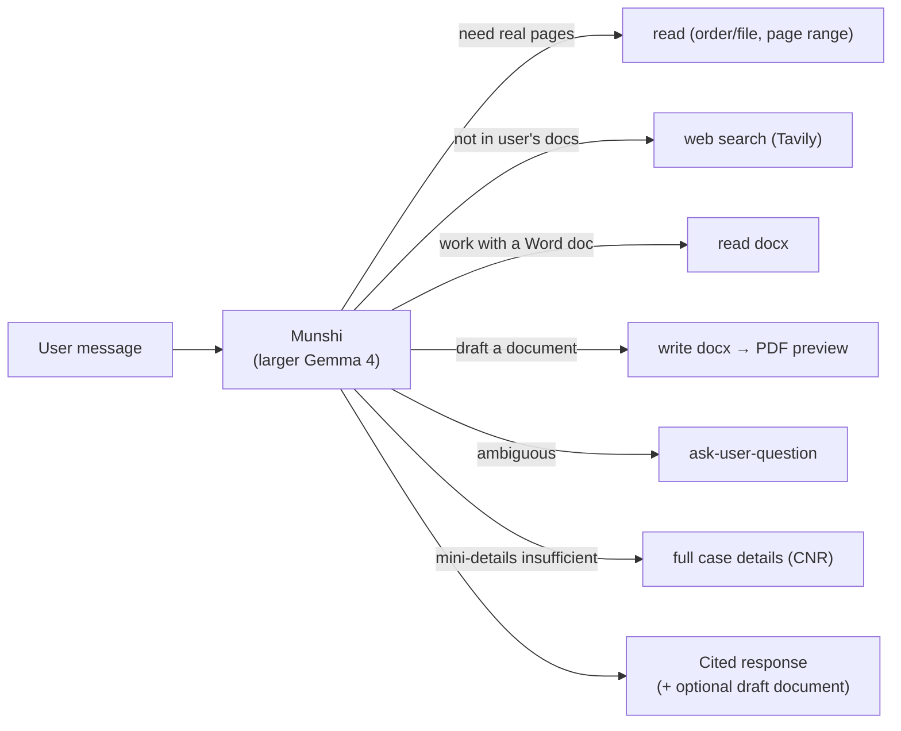
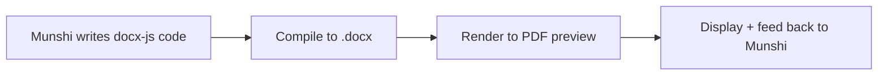

# Munshi — the AI Assistant

The **[Munshi](glossary.md#munshi)** is the reasoning layer, running on the **larger
[Gemma 4](glossary.md#gemma-4) model** (see [ADR-0003](decisions/0003-two-model-split.md)).
It reads what the [File Management](file-management.md) layer has produced and serves as the
user's **conversational assistant**.

## Context assembly

Before the Munshi reasons about anything, it is given a **context package** built from the
user's cases. The package contains:

- the **case mini-details across _all_ of the user's cases** — including the **order
  summaries** and **file summaries** generated during [ingestion](file-management.md);
- alongside the content, a set of **instructions** that govern the model's behaviour:
  - the **inline-citation** instruction,
  - the **tool-function** instructions, and
  - the instruction for the **ask-user-question** tool.

This is what lets the assistant **reason across the whole caseload** without holding every
full document — see [Case Mini-Detail / Summary](data-model.md#case-mini-detail--summary).

## Citation discipline

The Munshi is **required to cite its sources inline**. This is what makes its answers
**traceable rather than free-floating**. A claim can be cited to:

| Cite to | Identifies |
| --- | --- |
| a **CNR** | a whole [case](data-model.md#case) |
| an **Order ID + page number** | a specific page of an [order](data-model.md#order) |
| a **File ID + page number** | a specific page of a [file](data-model.md#file) |
| a **web URL** | information that came from a [web search](#the-toolset) |

## The toolset

The Munshi is a **tool-calling agent**. It has the following functions available:

| Tool | Inputs | What it does |
| --- | --- | --- |
| **read** | an **Order ID** with a *start page* and *end page*, **or** a **File ID** with a *start page* and *end page* | Retrieves the **actual content** of a document. Lets the assistant go beyond the summary and look at the real pages when it needs to. |
| **web search** | a query | Finds information that isn't in the user's own documents. Implemented via **[Tavily](glossary.md#tavily)**. |
| **read docx** | a **File ID** | Extracts the **text** of a stored Word document (e.g. one the Munshi drafted), so the assistant can read its `.docx` content back. |
| **write docx** | a **CNR**, a **document type**, a **summary**, the **[docx-js](glossary.md#docx-js) code** that generates the document, and a **descriptive file name** | Produces a Word document. The generated file then gets a **PDF preview**. |
| **ask-user-question** | a question | Lets the Munshi **pause and request clarification** from the user rather than guessing. |
| **full case details** | a **CNR** | Fetches the **complete record** for a case, for when the mini-details in context aren't enough. |

### The write-docx flow

The `write docx` tool ties into the shared [docx generation pipeline](document-handling.md#the-docx-generation-pipeline):

The resulting document is stored as a **[File](data-model.md#file)** (origin: AI-drafted)
against the given CNR.

## What it produces

The Munshi's output is:

- a **cited response**, and
- when the task calls for it, a **draft document** that the user can **open and edit** (in
  the [OnlyOffice editor](document-handling.md#document-editor)).

> The **tool schemas** and **context assembly** are implemented (see below). Prompt
> templates, the agent loop / stopping conditions, and how voice input is transcribed remain
> **[open questions](open-questions.md#munshi)** for implementation time.

## Implementation

[`@nowlez/munshi`](../packages/munshi) implements the toolset (`tools()` → the six tool
definitions with JSON Schemas) and **context assembly** (`assembleContext` builds the package
from mini-details + instructions; `DEFAULT_MUNSHI_INSTRUCTIONS` is a provisional default).
[`toMiniDetail`](../packages/contracts/src/data-model.ts) derives a case's mini-detail, and
the [CLI](../apps/cli) / [HTTP API](../apps/server) feed the Munshi the **real** caseload
(`CaseManagement.listMiniDetails()`), so it reasons over every added case rather than a blank
context.
`run` is a **multi-turn tool-calling loop** over the larger model via the
[`ModelClient`](decisions/0009-model-client-port.md) port ([`@nowlez/model`](../packages/model)):
the model may call tools, each dispatched to a handler, until it returns a cited answer
(`ask_user_question` short-circuits, turning the question back to the user). `munshiHandlers`
wires **`full_case_details`** (via the CourtDataSource), **`web_search`** (via Tavily,
[ADR-0010](decisions/0010-web-search-port.md)), **`write_docx`** (compile docx-js in a sandbox —
[ADR-0012](decisions/0012-docx-sandbox.md) — then store the `.docx` in a
[`BlobStore`](decisions/0014-blob-store-port.md) and attach an AI-drafted
[File](data-model.md#file) to the case), and **`read_docx`** (resolve that File's bytes from the
`BlobStore` and extract the text via Mammoth, in
[`@nowlez/document-handling`](../packages/document-handling)); `read` (real page bytes, Phase 6)
reports as unavailable until its dependencies arrive.

## See also

- [`file-management.md`](file-management.md) — produces the summaries the Munshi reasons over.
- [`document-handling.md`](document-handling.md) — the viewer/editor and docx pipeline the
  Munshi's outputs flow into.
- [`interfaces.md`](interfaces.md) — how the chat surfaces on web, mobile, and WhatsApp.
